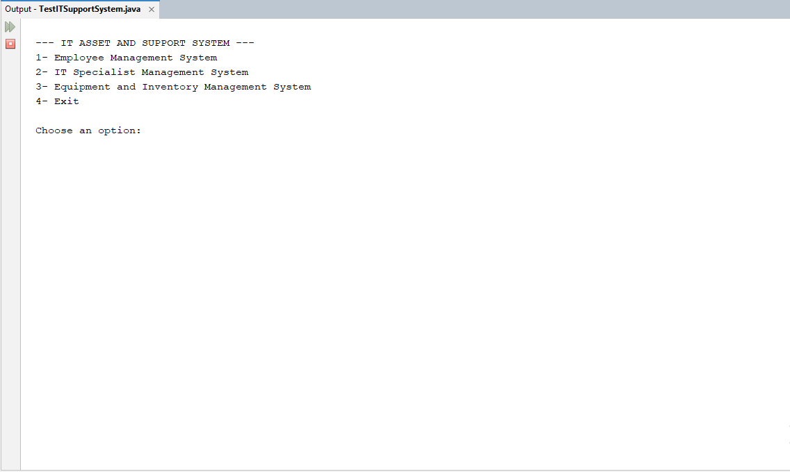
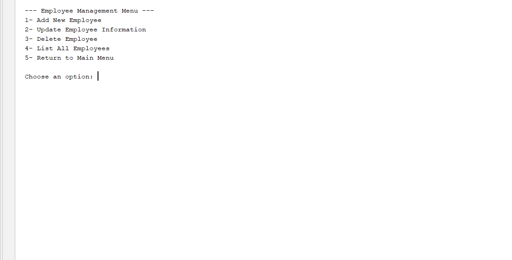
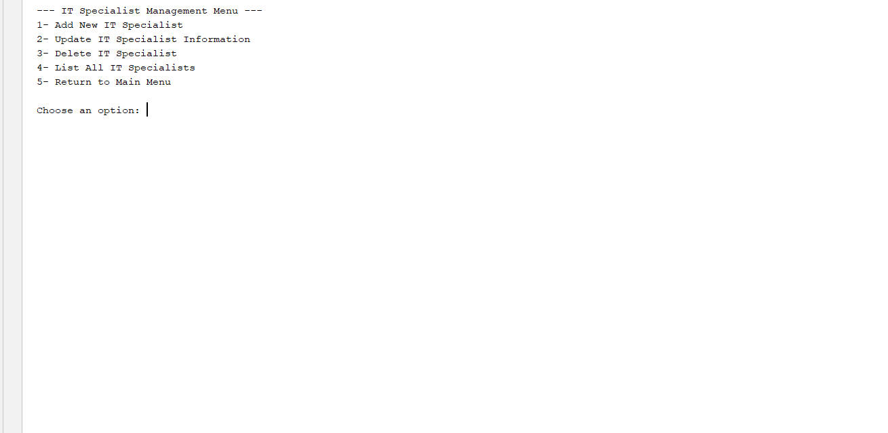
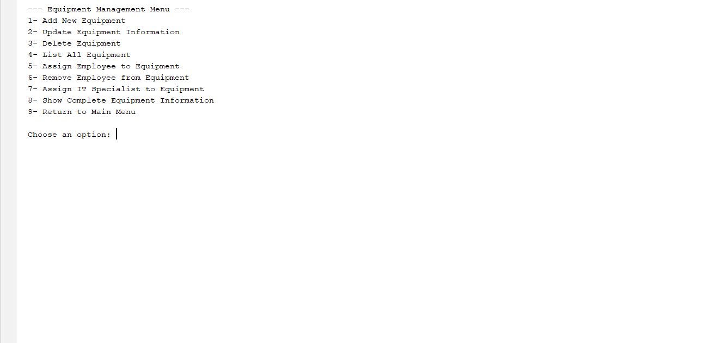
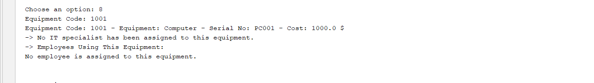
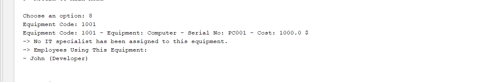

# IT Asset and Support Management System in Java

A console-based IT Asset and Support Management System developed in Java.

This project was created to reinforce my Java programming and object-oriented programming skills through university coursework and practical development.

The system provides separate management modules for employees, IT specialists, and equipment. It also allows equipment to be assigned to employees and IT specialists while maintaining relationships between these records through object-oriented programming and file handling.

## Features

* Add, update, delete, and list employees
* Add, update, delete, and list IT specialists
* Add, update, delete, and list equipment
* Assign employees to equipment
* Remove employees from equipment
* Assign responsible IT specialists to equipment
* Prevent duplicate employee assignments
* Prevent assigning the same IT specialist twice
* Display complete equipment information
* Maintain relationships between employees, IT specialists, and equipment
* Save and load data using files
* Handle file operations using exception handling

## Technologies Used

* Java
* Object-Oriented Programming (OOP)
* Abstract Classes
* Inheritance
* Encapsulation
* Polymorphism
* ArrayList
* File Handling
* Exception Handling
* NetBeans IDE

## Project Structure

```text
IT-Asset-and-Support-Management-System-in-Java/
├── README.md
├── LICENSE
├── TestITSupportSystem/
│   ├── nbproject/
│   ├── build.xml
│   ├── manifest.mf
│   └── src/
│       ├── TestITSupportSystem.java
│       ├── ManagementSystem.java
│       ├── Person.java
│       ├── Employee.java
│       ├── EmployeeManagementSystem.java
│       ├── ITSpecialist.java
│       ├── ITSpecialistManagementSystem.java
│       ├── Equipment.java
│       └── EquipmentManagementSystem.java
└── screenshots/
    ├── main-menu.png
    ├── employee-management.png
    ├── specialist-management.png
    ├── equipment-inventory.png
    ├── equipment-details.png
    └── equipment-assignment.png
```

## How to Run

Open the project in **NetBeans IDE** and run `TestITSupportSystem.java`.


## Screenshots

### Main Menu



### Employee Management



### Specialist Management



### Equipment Inventory



### Equipment Details



### Equipment Assignment



## Related Learning

This project was developed as part of my Java and object-oriented programming practice during my university studies.

I also completed the **Object Oriented Programming in Java** course offered by **IBM** on Coursera, which supported my understanding and practice of object-oriented programming concepts used in this project.

**Coursera Certificate:**

https://coursera.org/verify/OH51M0V346IE

**IBM Badge:**

[View Credly Badge](https://www.credly.com/badges/2a4a6b73-6c1f-4787-b793-442c64193357/public_url)

## Author

Silva Ibrahim

Computer Engineering Student

## License

This project is licensed under the MIT License.
